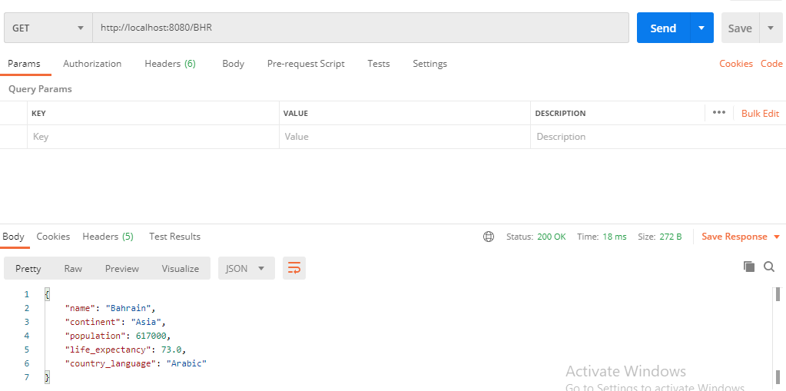
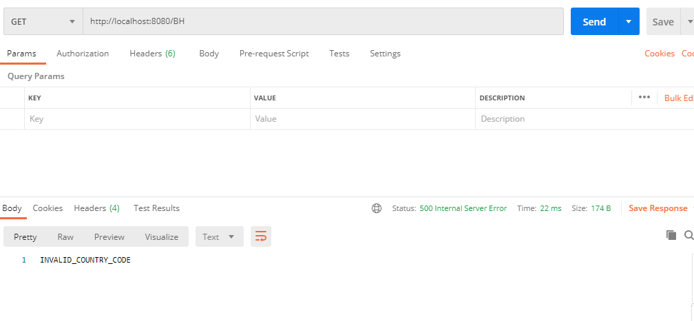
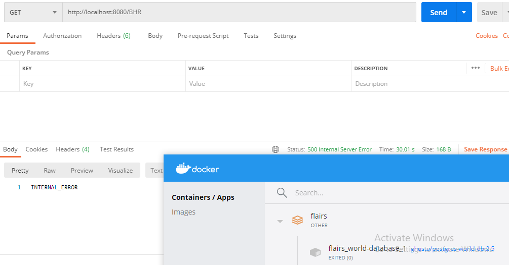

# Flairs (world-db)
 spring boot docker application with Jre8

steps:
1. mvn install -DskipTests
2. docker build flairstech .
3. docker-compose up
4. go to: http:/localhost:8080/BHR

samples:
1. Country code not found

2. World database down

